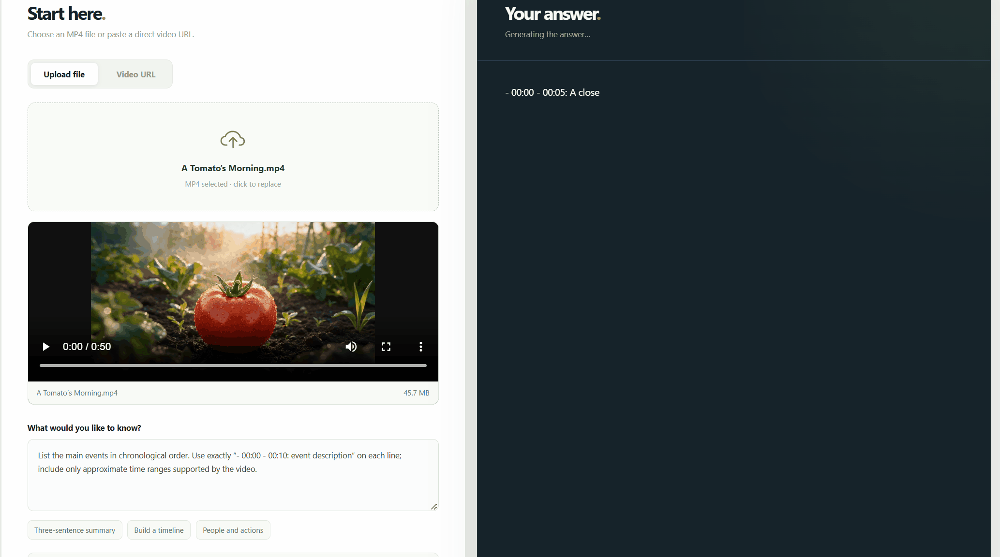

# Qwen Video Desk

[简体中文](README_ZH.md) | **English**

A local video analysis web app for **Qwen3.8-27B + vLLM**. Upload an MP4 or paste a video URL, then ask a question. The page shows the model connection status, a video preview, analysis progress, and the answer.

The web interface switches between English and Chinese from the top bar and remembers your choice in this browser. The default question and suggestions follow the selected language; saved questions and model answers stay in their original language.

The **Answer language** selector defaults to the interface language and can be set independently to English or Chinese for each new analysis. Both `/api/analyze` and `/api/analyze/stream` accept `answer_language=en` or `answer_language=zh`; omitted or `auto` keeps the previous behavior of following the question language. Changing the selector does not translate existing answers.

By default, the app asks for a chronological event list. Each event appears on its own line as `- 00:00 - 00:10: event description`, with approximate time ranges supported by the video. You can edit the question or choose another suggestion to request a different answer format.



The analysis API supports streaming: once the model starts generating, the answer appears progressively with a typing cursor. The completed answer is then saved to local history. The original nonstreaming `/api/analyze` endpoint remains available; the web app uses `/api/analyze/stream`.

When a streamed answer starts a new line with a timestamp, the video preview seeks to that point. After analysis, click any timestamp in the answer to jump to that frame. Seeking depends on the browser being able to play the video URL, and timestamps are estimates supplied by the model.

The project uses FastAPI and plain HTML/CSS/JavaScript, with no frontend build tools. The web app listens on both local IPv4 `127.0.0.1:7860` and IPv6 `[::1]:7860`, so either address used by `localhost:7860` works.

## Verified setup

- Windows 11 with Ubuntu WSL2
- NVIDIA RTX 5090 32GB
- vLLM 0.30.0, Python 3.12, CUDA 13.0
- `unsloth/Qwen3.8-27B-NVFP4`, 32K context, FP8 KV cache
- Local MP4 uploads and remote MP4 URLs tested end to end

This configuration uses about 29.8GB of VRAM while running. Model weights and test videos are **not included in this repository**.

## Already running vLLM? Start only the web app

First, make sure an OpenAI Chat Completions compatible vLLM service is running at `http://127.0.0.1:8000/v1`, serves the model as `Qwen3.8-27B`, and supports `video_url`. The web app and vLLM must be able to access the same video directory.

```bash
git clone https://github.com/jackzhenguo/qwen38-vllm-video.git
cd qwen38-vllm-video
python3.12 -m venv .venv
.venv/bin/pip install -r requirements-web.txt
mkdir -p videos
QWEN_VIDEO_DIR="$PWD/videos" .venv/bin/python run_web.py --port 7860
```

Open **http://localhost:7860**.

By default, the web app enables “Save this analysis and video to local history.” The answer, question, and video source are stored in local SQLite, and an uploaded MP4 remains in `QWEN_VIDEO_DIR`. Use “History” in the upper right to reopen a video, review its answer, or ask another question. If you turn history saving off, the uploaded file is removed after analysis. Deleting the last history entry that references a local video also removes that video file. For remote videos, history stores only the URL and does not download the video. The page shows up to 100 recent entries; files are not cleaned up automatically, so keep an eye on disk usage.
History cards show a video frame as a cover when the browser can decode the video. Covers load as you scroll through the list, including for existing records.

If your API address or model name differs, set `QWEN_API_BASE_URL` and `QWEN_MODEL`. `QWEN_MAX_UPLOAD_MB` defaults to 500.

## Deploy from scratch on one RTX 5090

Run these commands on Linux or WSL2. This is the combination verified for this project:

```bash
git clone https://github.com/jackzhenguo/qwen38-vllm-video.git ~/qwen38-vllm-video
cd ~/qwen38-vllm-video
uv python install 3.12
uv venv --python 3.12 .venv
uv pip install --python .venv/bin/python --torch-backend=cu130 'vllm==0.30.0' -r requirements-web.txt
```

In this setup, keep the CUDA runtime and compiler on version 13.0:

```bash
uv pip install --python .venv/bin/python --torch-backend=cu130 --no-deps --force-reinstall \
  nvidia-cuda-nvcc==13.0.88 nvidia-cuda-crt==13.0.88 \
  nvidia-nvvm==13.0.88 nvidia-cuda-cccl==13.0.85 \
  nvidia-cuda-runtime==13.0.96

.venv/bin/hf download unsloth/Qwen3.8-27B-NVFP4 --local-dir model
./serve.sh
```

`serve.sh` sets the CUDA compiler path, limits concurrent JIT compilation on the first run, and links the required CUDA wheel library directories. The first model load and kernel warmup can take several minutes. Start the web app in another terminal:

```bash
cd ~/qwen38-vllm-video
.venv/bin/python run_web.py --port 7860
```

On WSL2, the 21.8GiB of model weights may exceed the default memory limit. On the verified machine, `%USERPROFILE%\.wslconfig` contains:

```ini
[wsl2]
memory=24GB
swap=16GB
```

Run `wsl --shutdown` after changing this file. If loading the weights still fails with `unable to mmap ... Cannot allocate memory`, run `sudo sysctl -w vm.overcommit_memory=1` in WSL. On the verified machine, this setting is persisted in `/etc/sysctl.d/99-qwen38-vllm.conf`.

## Using Windows

Once the WSL setup above is ready, use `start-ui.ps1` from PowerShell to launch the web app. It locates the current project path in WSL and, by default, uses `qwen38-vllm-video/.venv/bin/python` in the WSL user's home directory:

```powershell
& '.\start-ui.ps1'
```

You can also analyze a local Windows video with the command line script. It copies the video into the WSL `videos/` directory:

```powershell
& '.\analyze-qwen38-video.ps1' -Video 'C:\path\to\video.mp4' -Question 'What happens in this video?'
```

### Start automatically after signing in to Windows

Once the model environment is ready, run this once in PowerShell:

```powershell
& '.\install-autostart.ps1'
```

The script registers two systemd services in Ubuntu WSL (model and web app) and creates a persistent task that runs when the current Windows user signs in. The task keeps WSL running. On future sign-ins, you can open `http://localhost:7860/` without starting a terminal once the model finishes loading. The web page appears first; analysis is available when the model status shows that it is connected. Initial loading usually takes several minutes.

Automatic startup depends on **signing in to Windows**; availability before sign-in is not guaranteed. WSL, the NVIDIA driver, and model files must still work. Check their status with:

```powershell
wsl -d Ubuntu -u root -- systemctl status qwen-video-vllm qwen-video-web
Get-ScheduledTask -TaskName 'Qwen Video Desk Autostart'
```

Stop and remove automatic startup:

```powershell
& '.\uninstall-autostart.ps1'
```

Linux command line example:

```bash
.venv/bin/python analyze_video.py 'https://example.com/video.mp4' --question 'What happens in this video?'
```

## Current limitations

- The web app accepts MP4 uploads. A video URL must point to a directly accessible video file.
- vLLM decodes the video and samples its frames on the server. The default sampling method has been verified. With the vLLM/Transformers versions in this setup, request-level `mm_processor_kwargs.fps` causes a processor error, so the UI does not expose an FPS setting.
- This project verifies **visual video analysis**. Speech recognition from a video's audio track has not been verified.
- 32K is the configured context length, not necessarily the model's native maximum. You can change `MAX_MODEL_LEN`, but a higher limit requires more VRAM.

## Environment variables

| Variable | Default | Purpose |
| --- | --- | --- |
| `QWEN_API_BASE_URL` | `http://127.0.0.1:8000/v1` | vLLM API used by the web app |
| `QWEN_MODEL` | `Qwen3.8-27B` | API model name |
| `QWEN_VIDEO_DIR` | `~/qwen38-vllm-video/videos` | Directory for uploaded videos; must match vLLM's allowed directory |
| `QWEN_HISTORY_DB` | `~/qwen38-vllm-video/history.sqlite3` | Local analysis history database |
| `QWEN_MAX_UPLOAD_MB` | `500` | Maximum size of one uploaded file |
| `MODEL_PATH` | `./model` | Model directory loaded by `serve.sh` |
| `VIDEO_DIR` | `./videos` | Local media directory allowed by `serve.sh` |
| `MAX_MODEL_LEN` | `32768` | vLLM context length |

The code is under the MIT License. The Qwen model and quantized weights have their own licenses; check the relevant model pages before using them.
