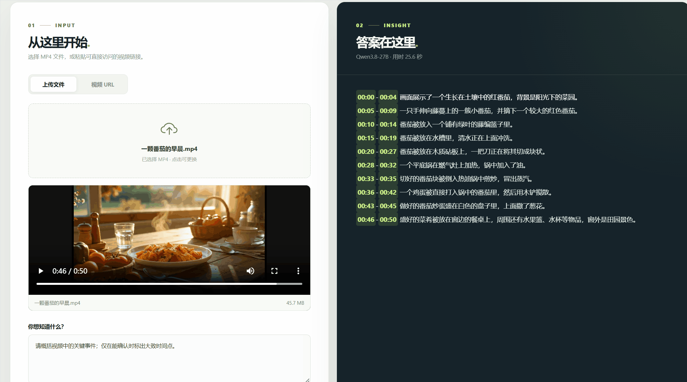

# Qwen Video Desk

**简体中文** | [English](README.md)

一个给 **Qwen3.8-27B + vLLM** 用的本地视频分析网页。直接上传 MP4，或粘贴视频 URL，然后用中文提问。页面会显示模型连接状态、视频预览、分析进度和回答。

网页顶部可切换中文和英文，浏览器会记住选择。默认问题和快捷问题会随语言切换；已有问题和模型回答保留原文。



分析接口支持流式输出：模型开始生成后，回答会逐段显示，并带有打字光标；完成后才写入本地历史。原有 `/api/analyze` 一次性返回接口仍可使用，网页使用 `/api/analyze/stream`。

流式回答在新行给出时间点时，左侧视频预览会跳到对应位置。分析完成后，点击答案中的时间点也可定位画面。跳转需要浏览器能播放该视频链接；时间点是模型给出的估计值。

项目使用 FastAPI + 原生 HTML/CSS/JavaScript，不依赖前端构建工具。网页同时监听本机的 IPv4 `127.0.0.1:7860` 和 IPv6 `[::1]:7860`，让浏览器访问 `localhost:7860` 时两种地址都可用。

## 已验证环境

- Windows 11 + Ubuntu WSL2
- NVIDIA RTX 5090 32GB
- vLLM 0.30.0、Python 3.12、CUDA 13.0
- `unsloth/Qwen3.8-27B-NVFP4`，32K 上下文，FP8 KV 缓存
- 本地 MP4 上传和远程 MP4 URL 均已端到端验证

这个配置运行时约占 29.8GB 显存。模型权重和测试视频**不包含在仓库里**。

## 已有 vLLM 服务：只启动网页

先确保兼容 OpenAI Chat Completions 的 vLLM 服务运行在 `http://127.0.0.1:8000/v1`，模型名为 `Qwen3.8-27B`，支持 `video_url`。网页和 vLLM 必须能访问同一个视频目录。

```bash
git clone https://github.com/jackzhenguo/qwen38-vllm-video.git
cd qwen38-vllm-video
python3.12 -m venv .venv
.venv/bin/pip install -r requirements-web.txt
mkdir -p videos
QWEN_VIDEO_DIR="$PWD/videos" .venv/bin/python run_web.py --port 7860
```

打开 **http://localhost:7860**。

网页默认勾选“保存本次分析与视频到本机历史”。回答、问题和视频来源保存在本地 SQLite；上传的 MP4 也会保留在 `QWEN_VIDEO_DIR` 中。可从右上角“历史记录”重新打开视频、查看回答或继续提问。取消勾选时，上传文件会在分析结束后删除。删除最后一条引用某个本地视频的历史记录时，对应视频文件也会删除。视频 URL 历史只保存 URL，不下载远程视频。历史最多显示最近 100 条，文件不会自动清理，请留意磁盘空间。
历史卡片会在浏览器能解码视频时显示视频画面封面，滚动到对应记录时才加载；已有记录也适用。

如果 API 地址或模型名不同，设置 `QWEN_API_BASE_URL` 和 `QWEN_MODEL`。`QWEN_MAX_UPLOAD_MB` 默认为 500。

## 从零在单张 RTX 5090 上部署

推荐在 Linux 或 WSL2 中执行。以下是本项目实际验证过的组合：

```bash
git clone https://github.com/jackzhenguo/qwen38-vllm-video.git ~/qwen38-vllm-video
cd ~/qwen38-vllm-video
uv python install 3.12
uv venv --python 3.12 .venv
uv pip install --python .venv/bin/python --torch-backend=cu130 'vllm==0.30.0' -r requirements-web.txt
```

在这套环境里，CUDA 运行库与编译器需要统一到 13.0：

```bash
uv pip install --python .venv/bin/python --torch-backend=cu130 --no-deps --force-reinstall \
  nvidia-cuda-nvcc==13.0.88 nvidia-cuda-crt==13.0.88 \
  nvidia-nvvm==13.0.88 nvidia-cuda-cccl==13.0.85 \
  nvidia-cuda-runtime==13.0.96

.venv/bin/hf download unsloth/Qwen3.8-27B-NVFP4 --local-dir model
./serve.sh
```

`serve.sh` 会设置 CUDA 编译器路径、限制首次 JIT 编译并发，并补齐 CUDA 轮子的库目录链接。模型首次加载和内核预热可能需要数分钟。另开终端启动网页：

```bash
cd ~/qwen38-vllm-video
.venv/bin/python run_web.py --port 7860
```

在 WSL2 中，21.8GiB 权重可能超过默认内存上限。本机将 `%USERPROFILE%\.wslconfig` 设为：

```ini
[wsl2]
memory=24GB
swap=16GB
```

修改后运行 `wsl --shutdown` 生效。如果加载权重时仍报 `unable to mmap ... Cannot allocate memory`，可在 WSL 里运行 `sudo sysctl -w vm.overcommit_memory=1`；本机已把该设置写入 `/etc/sysctl.d/99-qwen38-vllm.conf`。

## Windows 使用

上面的 WSL 环境准备好后，PowerShell 中可用 `start-ui.ps1` 启动网页。它会自动找到当前项目在 WSL 中的路径，默认使用 WSL 用户目录下 `qwen38-vllm-video/.venv/bin/python`：

```powershell
& '.\start-ui.ps1'
```

也可以用命令行脚本分析 Windows 本地视频，它会复制一份到 WSL 的 `videos/` 目录：

```powershell
& '.\analyze-qwen38-video.ps1' -Video 'C:\path\to\video.mp4' -Question '这段视频发生了什么？'
```

### 登录 Windows 后自动启动

模型环境准备好后，在 PowerShell 中运行一次：

```powershell
& '.\install-autostart.ps1'
```

脚本会在 Ubuntu WSL 中注册两个 systemd 服务（模型和网页），并创建当前 Windows 用户登录时运行的驻留任务。任务会保持 WSL 运行；以后登录 Windows 后，无需打开终端，待模型加载完成即可访问 `http://localhost:7860/`。网页会先出现，模型状态变为“在线”后即可分析视频。首次加载通常需要数分钟。

这套自动启动依赖**用户登录 Windows**，不保证在登录界面之前可用。WSL、NVIDIA 驱动和模型文件仍需正常工作。查看状态：

```powershell
wsl -d Ubuntu -u root -- systemctl status qwen-video-vllm qwen-video-web
Get-ScheduledTask -TaskName 'Qwen Video Desk Autostart'
```

停止并移除自动启动：

```powershell
& '.\uninstall-autostart.ps1'
```

Linux 命令行示例：

```bash
.venv/bin/python analyze_video.py 'https://example.com/video.mp4' --question '这段视频发生了什么？'
```

## 当前限制

- 网页上传支持 MP4；视频 URL 需要指向可直接访问的视频文件。
- 模型会由 vLLM 在服务端解码、采样视频帧。当前已验证默认采样方式；在这套 vLLM/Transformers 版本中，请求级 `mm_processor_kwargs.fps` 会触发处理器错误，因此界面没有开放帧率设置。
- 本项目验证的是**视频画面分析**；没有验证视频音轨的语音识别。
- 32K 是启动配置，不代表模型的原生上下文上限。可通过 `MAX_MODEL_LEN` 调整，但更高上限需要更多显存。

## 环境变量

| 变量 | 默认值 | 用途 |
| --- | --- | --- |
| `QWEN_API_BASE_URL` | `http://127.0.0.1:8000/v1` | 网页连接的 vLLM API |
| `QWEN_MODEL` | `Qwen3.8-27B` | API 模型名 |
| `QWEN_VIDEO_DIR` | `~/qwen38-vllm-video/videos` | 网页暂存上传视频的目录，需与 vLLM 的允许目录一致 |
| `QWEN_HISTORY_DB` | `~/qwen38-vllm-video/history.sqlite3` | 本地分析历史数据库 |
| `QWEN_MAX_UPLOAD_MB` | `500` | 单个上传文件大小上限 |
| `MODEL_PATH` | `./model` | `serve.sh` 加载的模型目录 |
| `VIDEO_DIR` | `./videos` | `serve.sh` 允许读取的本地媒体目录 |
| `MAX_MODEL_LEN` | `32768` | vLLM 上下文长度 |

代码使用 MIT License。Qwen 模型和量化权重有各自的许可，使用模型时请查看对应模型页面。
